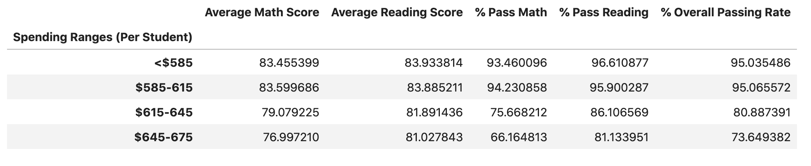
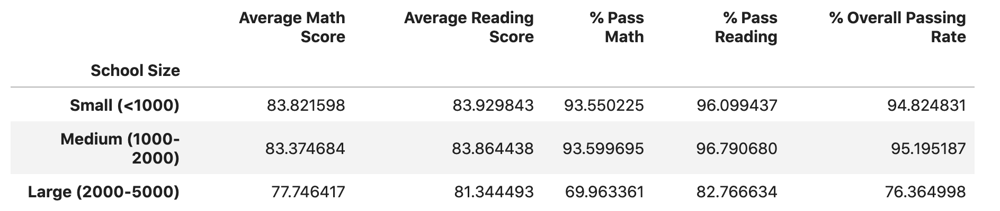
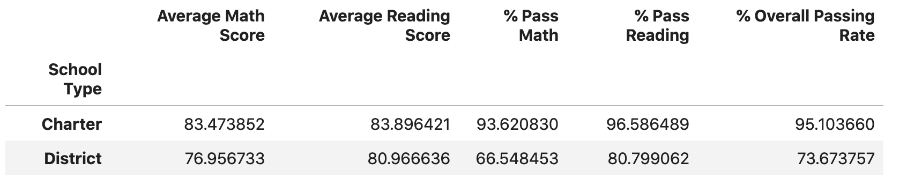

# Pycity Schools 
In this exercise, we are looking at what effects school spending, school size and school type have on reading and math test scores for this particular school district. To do this, I will be analyzing the district-wide standardized test results. I have been given access to every student's math and reading scores, as well as various information on the schools they attend. I have aggregated the data in order to showcase obvious trends in school performance. My observations are included below.

## Tools being used to aggregate and analyze this data:
- #### Python/Pandas

## Observable Trends
#### Qustion 1: Does an increase in spending per student have an impact on the average Math and Reading test scores?

- One would expect to observe that as "Spending per Student" increased, the average test scores would increase. --This data does NOT seem to support this. In fact, we see that as spending per student increases, there are sharp declines in average test scores for both math and reading.

 
#### Question 2: Does school size impact the average Math and Reading test scores?

- There does appear to be a correlation between school size and students' performances on their math and reading test. Data indicates as schools size increases, average test scores for both math and reading decline. Additionally, smaller and medium sized schools appeared to have a significantly higher overall pass rate when compared to large schools. Perhaps this can be explained by smaller class sizes, and the instructors' abilty to have more one on one time with each student.

 
#### Question 3: Which scools performed better, Charter Schools or District Schools?
- Charter schools outperformed district schools in both math and reading, and Charter schools significantly outperformed district schools in terms of their students overall pass rate.

